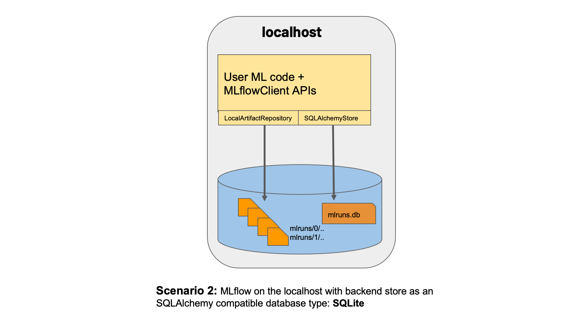
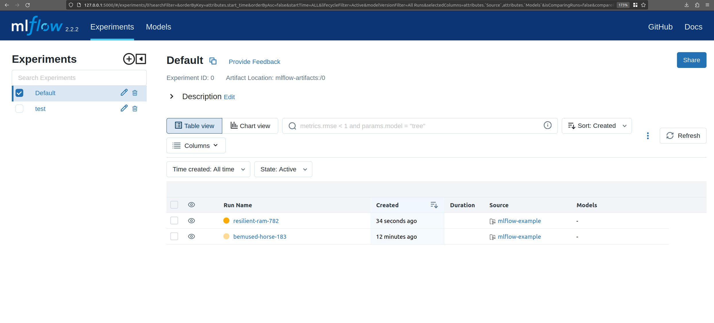
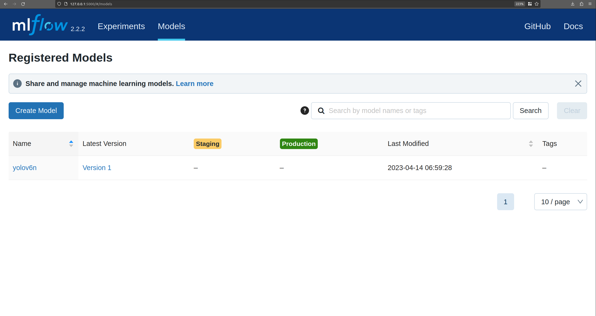
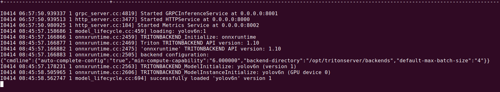

# Mlflow with Triton Inference Server  

## Lets start with Mlflow
**Introduction:**

MLflow is an open source platform for managing the end-to-end machine learning lifecycle. It tackles four primary functions:

- Tracking experiments to record and compare parameters and results ([MLflow Tracking](<https://mlflow.org/docs/latest/tracking.html#tracking>)).

- Packaging ML code in a reusable, reproducible form in order to share with other data scientists or transfer to production ([MLflow Projects](<https://mlflow.org/docs/latest/projects.html#projects>)).

- Managing and deploying models from a variety of ML libraries to a variety of model serving and inference platforms ([MLflow Models](<https://mlflow.org/docs/latest/models.html#models>)).

- Providing a central model store to collaboratively manage the full lifecycle of an MLflow Model, including model versioning, stage transitions, and annotations ([MLflow Model Registry](<https://mlflow.org/docs/latest/model-registry.html#registry>)).


**Installation:**

Install mlflow in python env

```
pip install mlflow # includes UI
pip install mlflow[extras] # downloads extra ML libraries
```

### [MLflow on ](<https://mlflow.org/docs/latest/tracking.html#id29>)[localhost](<http://localhost>)[ with SQLite](<https://mlflow.org/docs/latest/tracking.html#id29>):

```
mlflow server --backend-store-uri sqlite:///mlflow.db --default-artifact-root ./artifacts --host 0.0.0.0 --port 5000
```


  

<u>Backend Store </u>: To store Run/Experiment information along with Model Store info as db.  

<u>Artifacts</u>: Output files of Runs/Experiements (Models, conifgs, labels etc)


For Other Types of Tracking methods [check here](<https://mlflow.org/docs/latest/tracking.html#id27>).


**Start Logging runs/experiments using Python API's:**

### [Logging Functions](<https://mlflow.org/docs/latest/tracking.html#id59>)

[`mlflow.set_tracking_uri()`](<https://mlflow.org/docs/latest/python_api/mlflow.html#mlflow.set_tracking_uri>) connects to a tracking URI. You can also set the `MLFLOW_TRACKING_URI` environment variable to have MLflow find a URI from there. In both cases, the URI can either be a HTTP/HTTPS URI for a remote server, a database connection string, or a local path to log data to a directory. The URI defaults to `mlruns`.

[`mlflow.create_experiment()`](<https://mlflow.org/docs/latest/python_api/mlflow.html#mlflow.create_experiment>) creates a new experiment and returns its ID. Runs can be launched under the experiment by passing the experiment ID to `mlflow.start_run`.

[`mlflow.set_experiment()`](<https://mlflow.org/docs/latest/python_api/mlflow.html#mlflow.set_experiment>) sets an experiment as active. If the experiment does not exist, creates a new experiment. If you do not specify an experiment in [`mlflow.start_run()`](<https://mlflow.org/docs/latest/python_api/mlflow.html#mlflow.start_run>), new runs are launched under this experiment.

[`mlflow.start_run()`](<https://mlflow.org/docs/latest/python_api/mlflow.html#mlflow.start_run>) returns the currently active run (if one exists), or starts a new run and returns a [`mlflow.ActiveRun`](<https://mlflow.org/docs/latest/python_api/mlflow.html#mlflow.ActiveRun>) object usable as a context manager for the current run. You do not need to call `start_run` explicitly: calling one of the logging functions with no active run automatically starts a new one.

[`mlflow.end_run()`](<https://mlflow.org/docs/latest/python_api/mlflow.html#mlflow.end_run>) ends the currently active run, if any, taking an optional run status.

[`mlflow.log_metric()`](<https://mlflow.org/docs/latest/python_api/mlflow.html#mlflow.log_metric>) logs a single key-value metric. The value must always be a number. MLflow remembers the history of values for each metric. Use [`mlflow.log_metrics()`](<https://mlflow.org/docs/latest/python_api/mlflow.html#mlflow.log_metrics>) to log multiple metrics at once.

Example to use the above functions:

<!-- Mlflow tracking for a Linear Regression model: -->

<!-- ```python
import os
import warnings
import sys

import pandas as pd
import numpy as np
from sklearn.metrics import mean_squared_error, mean_absolute_error, r2_score
from sklearn.model_selection import train_test_split
from sklearn.linear_model import ElasticNet
from urllib.parse import urlparse
import mlflow
import mlflow.sklearn

import logging

logging.basicConfig(level=logging.WARN)
logger = logging.getLogger(__name__)


def eval_metrics(actual, pred):
    rmse = np.sqrt(mean_squared_error(actual, pred))
    mae = mean_absolute_error(actual, pred)
    r2 = r2_score(actual, pred)
    return rmse, mae, r2


if __name__ == "__main__":
    warnings.filterwarnings("ignore")
    np.random.seed(40)

    # Read the wine-quality csv file from the URL
    csv_url = (
        "http://archive.ics.uci.edu/ml/machine-learning-databases/wine-quality/winequality-red.csv"
    )
    try:
        data = pd.read_csv(csv_url, sep=";")
    except Exception as e:
        logger.exception(
            "Unable to download training & test CSV, check your internet connection. Error: %s", e
        )

    # Split the data into training and test sets. (0.75, 0.25) split.
    train, test = train_test_split(data)

    # The predicted column is "quality" which is a scalar from [3, 9]
    train_x = train.drop(["quality"], axis=1)
    test_x = test.drop(["quality"], axis=1)
    train_y = train[["quality"]]
    test_y = test[["quality"]]

    alpha = float(sys.argv[1]) if len(sys.argv) > 1 else 0.5
    l1_ratio = float(sys.argv[2]) if len(sys.argv) > 2 else 0.5

    with mlflow.start_run(): # Initiate mlflow tracking
        lr = ElasticNet(alpha=alpha, l1_ratio=l1_ratio, random_state=42)
        lr.fit(train_x, train_y)

        predicted_qualities = lr.predict(test_x)

        (rmse, mae, r2) = eval_metrics(test_y, predicted_qualities)

        print("Elasticnet model (alpha=%f, l1_ratio=%f):" % (alpha, l1_ratio))

        mlflow.log_param("alpha", alpha)
        mlflow.log_param("l1_ratio", l1_ratio)
        mlflow.log_metric("rmse", rmse)
        mlflow.log_metric("r2", r2)
        mlflow.log_metric("mae", mae)

        tracking_url_type_store = urlparse(mlflow.get_tracking_uri()).scheme

        # Model registry does not work with file store
        if tracking_url_type_store != "file":

            # Register the model
            # There are other ways to use the Model Registry, which depends on the use case,
            # please refer to the doc for more information:
            # https://mlflow.org/docs/latest/model-registry.html#api-workflow
            mlflow.sklearn.log_model(lr, "model", registered_model_name="ElasticnetWineModel")
        else:
            mlflow.sklearn.log_model(lr, "model")
``` -->

View the dashboard at [http://localhost:5000](<http://localhost:5000>) where the mlflow server is running.



# [MLflow Model Registry:](<https://mlflow.org/docs/latest/model-registry.html#api-workflow>)

The MLflow Model Registry component is a centralized model store, set of APIs, and UI, to collaboratively manage the full lifecycle of an MLflow Model. It provides model lineage (which MLflow experiment and run produced the model), model versioning, stage transitions (for example from staging to production), and annotations.

Adding the model to Model Registry:

```python
from random import random, randint
from sklearn.ensemble import RandomForestRegressor

import mlflow
import mlflow.sklearn

with mlflow.start_run(run_name="YOUR_RUN_NAME") as run:
    params = {"n_estimators": 5, "random_state": 42}
    sk_learn_rfr = RandomForestRegressor(**params)

    # Log parameters and metrics using the MLflow APIs
    mlflow.log_params(params)
    mlflow.log_param("param_1", randint(0, 100))
    mlflow.log_metrics({"metric_1": random(), "metric_2": random() + 1})

    # Log the sklearn model and register as version 1
    mlflow.sklearn.log_model(
        sk_model=sk_learn_rfr,
        artifact_path="sklearn-model",
        registered_model_name="sk-learn-random-forest-reg-model"
    )
```

More features like Fetching Serving, Renaming etc. [https://mlflow.org/docs/latest/model-registry.html#id6](<https://mlflow.org/docs/latest/model-registry.html#id6>)  


# Triton Inference Server

<strong>Serving with Triton Inference Server:</strong>

For serving models with Triton inference Server, Nvidia provides Mlflow Triton Plugin.

[https://github.com/triton-inference-server/server/tree/r22.09/deploy/mlflow-triton-plugin](<https://github.com/triton-inference-server/server/tree/r22.09/deploy/mlflow-triton-plugin>)

[https://catalog.ngc.nvidia.com/orgs/nvidia/teams/morpheus/containers/mlflow-triton-plugin](<https://catalog.ngc.nvidia.com/orgs/nvidia/teams/morpheus/containers/mlflow-triton-plugin>)

[https://github.com/nv-morpheus/Morpheus/tree/bc791eaec7ffa19db2fd292f8fb65a74473885a2/models/mlflow](<https://github.com/nv-morpheus/Morpheus/tree/bc791eaec7ffa19db2fd292f8fb65a74473885a2/models/mlflow>)

Currently it supports onnx and triton model flavours.

**Steps:**

1. Run Triton Inference Server

2. Run MLFlow Triton Plugin

3. Publish Models to Mlflow server

4. Deploy the published models to Triton


Start Triton Inference Server in <u>EXPLICIT</u> mode

```bash
docker run --gpus=1 --rm -p8000:8000 -p8001:8001 -p8002:8002 -v/home/ubuntu/triton_models:/models nvcr.io/nvidia/tritonserver:22.12-py3 tritonserver --model-repository=/models --model-control-mode=explicit

# Explicit mode does not load models at runtime.
```


**Mlfow Triton Plugin**:

Create a folder in the machine with name <u>triton_models</u>

 and copy your models to this folder with model structure as required by Triton Server

**Model Structure for Inferencing:**

```
└── model_folder/      # model_folder
    ├── 1              # Version of the model
        └── model.ckpt # model file
    ├── config.pbxt    # model configfile
    └── labels.txt     # labels of classes
```

Here we take an example of yolov6n:
```
└── yolov6n/      # model_folder
    ├── 1              # Version of the model
        └── model.onnx # model file
    ├── config.pbxt    # model configfile
    └── labels.txt     # labels of classes
```

Create MLFlow Triton Plugin container with volume mount to Triton model repository and open bash in the container:

```bash
docker run -it -v /home/ubuntu/triton_models:/triton_models \
--env TRITON_MODEL_REPO=/triton_models \
--gpus '"device=0"' \
--net=host \
--rm \
-d nvcr.io/nvidia/morpheus/mlflow-triton-plugin:2.2.2

docker exec -it <container_name> 
```

Export the Mlflow tracking server url and start the server: 
```bash
export MLFLOW_TRACKING_URI=http://localhost:5000

nohup mlflow server --backend-store-uri sqlite:////tmp/mlflow-db.sqlite --default-artifact-root /mlflow/artifacts --host 0.0.0.0 &
```

Publish reference models to MLflow:

```bash
python publish_model_to_mlflow.py --model_name yolov6n  --model_directory /triton_models/yolov6n --flavor triton
```



Create Deployments the models to Triton Inference Server:

```bash
mlflow deployments create -t triton --flavor triton --name yolov6n -m models:/yolov6n/1

```

If you want to delete and update the model:
```bash
mlflow deployments delete -t triton --name yolov6n

mlflow deployments update -t triton --flavor triton --name yolov6n -m models:/yolov6n/2
```
## For infererencing we have 2 options:  

### 1 ) Perform inference with mlflow:  
  

```bash 
mlflow deployments predict -t triton --name yolov6n --input-path <path-to-the-examples-directory>/input.json --output-path output.json

#Example input json for yolov6n:
#img_ex is list of ndarray
{"inputs":[{"name":"images","datatype":"FP32","shape":[1, 3, 640, 640],"data":'f'{img_ex}'"}]}
```

### 2 ) Perform inference with triton http client:  

```python
import tritonclient.http as httpclient

model_name = "yolov6n"
triton_client = httpclient.InferenceServerClient(url="0.0.0.0:8000")
triton_client.get_model_metadata(model_name)
```

{'name': 'yolov6n',
 'versions': ['1'],
 'platform': 'onnxruntime_onnx',
 'inputs': [{'name': 'images', 'datatype': 'FP32', 'shape': [1, 3, 640, 640]}],
 'outputs': [{'name': 'outputs', 'datatype': 'FP32', 'shape': [1, 8400, 85]}]}

```python
inputs = []
outputs = []
im = np.array(im, dtype=np.float32) # im is the image numpy array
inputs.append(httpclient.InferInput('images', [1,3,640,640], "FP32"))
outputs.append(httpclient.InferRequestedOutput("outputs"))
inputs[0].set_data_from_numpy(im)

results = triton_client.infer(model_name=model_name, inputs=inputs)
results.get_response()
```
{'model_name': 'yolov6n',
 'model_version': '1',
 'outputs': [{'name': 'outputs',
   'datatype': 'FP32',
   'shape': [1, 8400, 85],
   'parameters': {'binary_data_size': 2856000}}]}  


<b>References</b>:  
https://github.com/mlflow/mlflow  
https://github.com/triton-inference-server  
https://github.com/triton-inference-server/client  
https://catalog.ngc.nvidia.com/orgs/nvidia/teams/morpheus/containers/mlflow-triton-plugin
---

